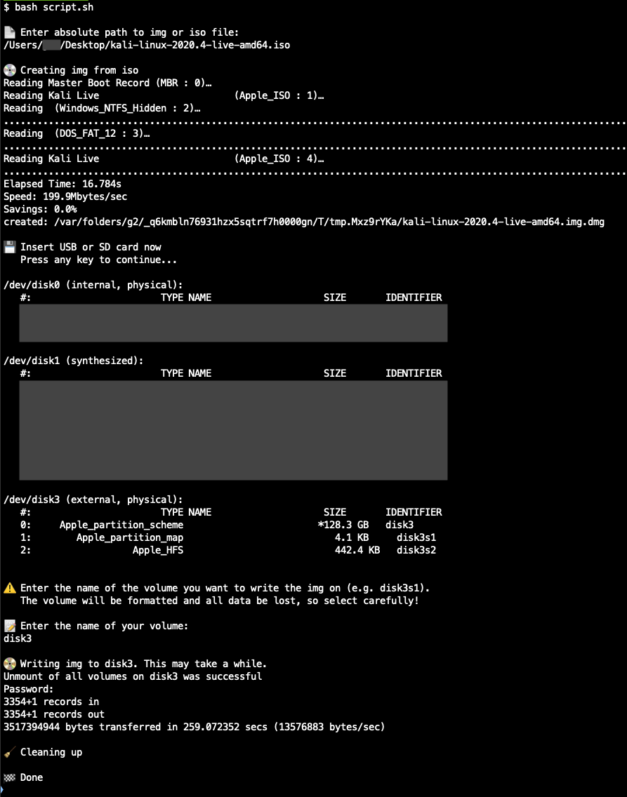

# Write img to disk
Simple bash script that writes an iso or img file to a USB or SD card. 
The bash script is now also available as binary.

## Installation
### Option 1: Bash script
Download the bash script file and execute it like this `bash script.sh`.

### Option 2: Binary (Beta)
1. Run `sudo curl https://raw.githubusercontent.com/faessler/bash-write-img-to-disk/master/witd -o /usr/local/bin/witd && sudo chmod 755 witd` to download the binary and put it in _/usr/local/bin_.
2. After that you can execute `witd` from anywhere.

Note: You can put the binary also in another directory if you don't want to use _/usr/local/bin_. If you use _/usr/local/bin_ make sure that the directory exists and is in your path (`echo $PATH`). Execute `export PATH=$PATH:/usr/local/bin` to add it to your path.

## Preview
Follow the instructions in the terminal.

## Development
Update binary: `shc -f ./script.sh -o ./witd`
